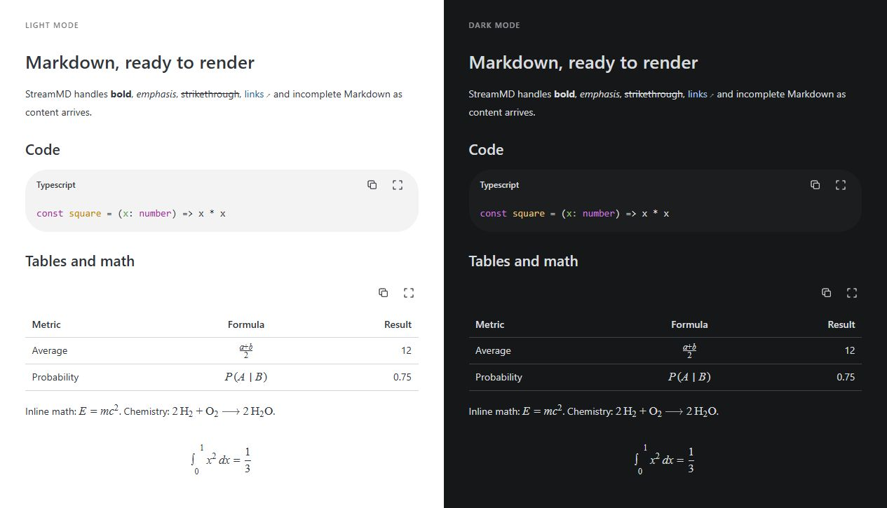
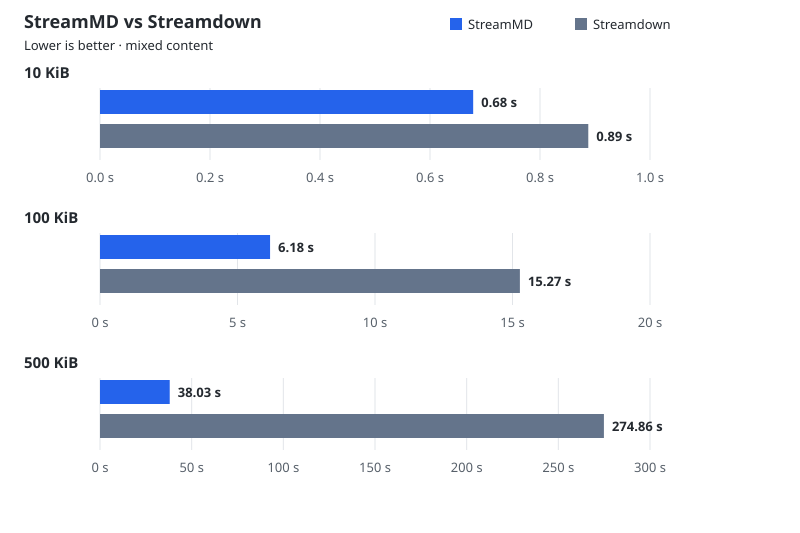

# StreamMD



### Fast Markdown rendering optimized for AI token streaming.

Render code, tables, KaTeX and Mermaid with consistent light/dark styles. Register your own tags and components without importing a chat application. Built for JavaScript and Vue, with built-in completion.

## What is included

These renderers are built into StreamMD; no separate plugin installation is needed.

| Feature | Package | Purpose |
| --- | --- | --- |
| [Syntax highlighting](docs/rendering.md#code-and-mermaid) | `highlight.js` | Highlighted code blocks with copy and expand controls |
| [Diagrams](docs/rendering.md#code-and-mermaid) | `mermaid` | Mermaid diagrams with source view and light/dark themes |
| [Math](docs/rendering.md#math) | `katex` | Inline and display math, chemistry and expressions in tables |

- [**GitHub Flavored Markdown (GFM)**](docs/rendering.md#github-flavored-markdown): nested lists, task lists, tables, links and fenced code.
- [**Unterminated Block Parsing**](docs/termination.md) formats incomplete Markdown as content arrives.
- [Code highlighting](docs/rendering.md#code-and-mermaid), copy buttons and [expanded table views](docs/rendering.md#tables).
- [KaTeX math](docs/rendering.md#math), including inline/display expressions, matrices, chemistry and table cells.
- [Mermaid diagrams](docs/rendering.md#code-and-mermaid) with source/diagram toggle, expanded views and light/dark themes.
- [Custom tags, tokenizers and Vue components](docs/extensions.md), registered per engine.
- [Scoped CSS](docs/rendering.md#css), [TypeScript declarations and a DOM-free JavaScript core](docs/api.md#core).

StreamMD does not fetch model output, schedule updates, execute code or provide
chat/tool UI. Pass the accumulated source to `content`; it remains your source.

## Benchmarks

| Size | StreamMD | Streamdown |
| --- | ---: | ---: |
| 10 KiB | 0.68 s | 0.89 s |
| 100 KiB | 6.18 s | 15.27 s |
| 500 KiB | 38.03 s | 274.86 s |

Mixed content, 100 updates, including math, highlighting, diagrams, images and automatic scrolling. No added delay at 10/100 KiB; 500 KiB adds 100 ms per update for both libraries, counted in the total.



[Method and reproduction](benchmarks/comparison/README.md). Raw results: [10 KiB](benchmarks/results/comparison-10-kib.json) · [100 KiB](benchmarks/results/comparison-100-kib.json) · [500 KiB](benchmarks/results/comparison-500-kib.json).

## Install

This repository is prepared for its first release. It is not published to npm yet.
Build a package locally:

```sh
npm ci
npm pack
```

Install the resulting tarball in a Vue 3 application with one command:

```sh
npm install /path/to/streammd-0.1.0.tgz
```

```vue
<script setup>
import { MarkdownRenderer } from 'streammd/vue'
import 'streammd/style.css'

const markdown = '# Hello\n\n**Markdown** with $x^2$.'
</script>

<template>
  <MarkdownRenderer :content="markdown" theme="dark" />
</template>
```

Use the core directly in JavaScript, including Node:

```js
import { createMarkdownEngine } from 'streammd'

const engine = createMarkdownEngine()
const html = engine.renderHtml('**An unfinished sentence')
// <p><strong>An unfinished sentence</strong></p>
```

## Explore

```sh
npm run build
npm run docs
```

The local docs and editable playground open at `http://127.0.0.1:3111`.

| Guide | Covers |
| --- | --- |
| [Getting started](docs/getting-started.md) | Installation, Vue and Node |
| [API](docs/api.md) | Props, core functions and exports |
| [Extensions](docs/extensions.md) | Custom tags and nested components |
| [Rendering](docs/rendering.md) | Math, Mermaid, completion, CSS and limits |
| [Benchmarks](benchmarks/README.md) | Varied workloads and reproducible results |
| [Security](SECURITY.md) | Input policy and trusted extensions |
| [Release guide](docs/releasing.md) | GitHub/npm preparation and verification |
| [Verification](docs/release-verification.md) | Local release checks and evidence |
| [Architecture](docs/extraction.md) | Core, Vue integration and source extraction |

## Run benchmarks

```sh
npm run benchmark
npm run benchmark:core
```

The production browser suite covers prose, nested structures, code, tables,
KaTeX, Mermaid, local images, custom tags and mixed documents at 10/100/500 KiB
targets. It checks rendered elements and exports raw results. Completion is always
included. See the [methodology](benchmarks/README.md) and
[recorded results](benchmarks/RESULTS.md) before comparing numbers.

## Development

Node 22.12 or newer. Vue 3.5+ is required for `streammd/vue`; core-only consumers
do not need Vue. All published JavaScript is ESM.

```sh
npm test
npm run typecheck
npm run release:check
```

See [CONTRIBUTING.md](CONTRIBUTING.md). This project is independent of the
unrelated `stream-md` project, which also uses the StreamMD name.

## Licence

[MIT](LICENSE) for StreamMD code. Dependencies and bundled assets retain their
own licences; see [third-party notices](THIRD_PARTY_NOTICES.md).
