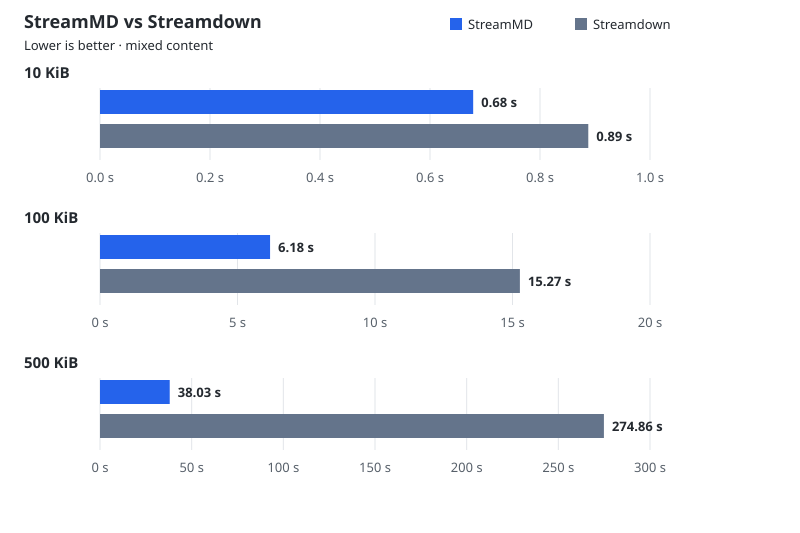

# StreamMD versus Streamdown

| Size | StreamMD | Streamdown |
| --- | ---: | ---: |
| 10 KiB | 0.68 s | 0.89 s |
| 100 KiB | 6.18 s | 15.27 s |
| 500 KiB | 38.03 s | 274.86 s |

Mixed content, 100 updates, including math, highlighting, diagrams, images and automatic scrolling. No added delay at 10/100 KiB; 500 KiB adds 100 ms per update for both libraries, counted in the total.

All measured and warmup rendering checks passed.

Browser: Mozilla/5.0 (Windows NT 10.0; Win64; x64) AppleWebKit/537.36 (KHTML, like Gecko) Chrome/152.0.0.0 Safari/537.36

Reported logical processors: 16.

StreamMD 0.1.0 and Streamdown 2.6.0; Vue 3.5.30; React 19.2.8.

Measured 2026-09-06T07:47:03.662Z, 2026-09-06T07:49:31.112Z, 2026-09-06T08:20:34.721Z.

[Method](comparison/README.md) · [Raw results](results/comparison.json)
